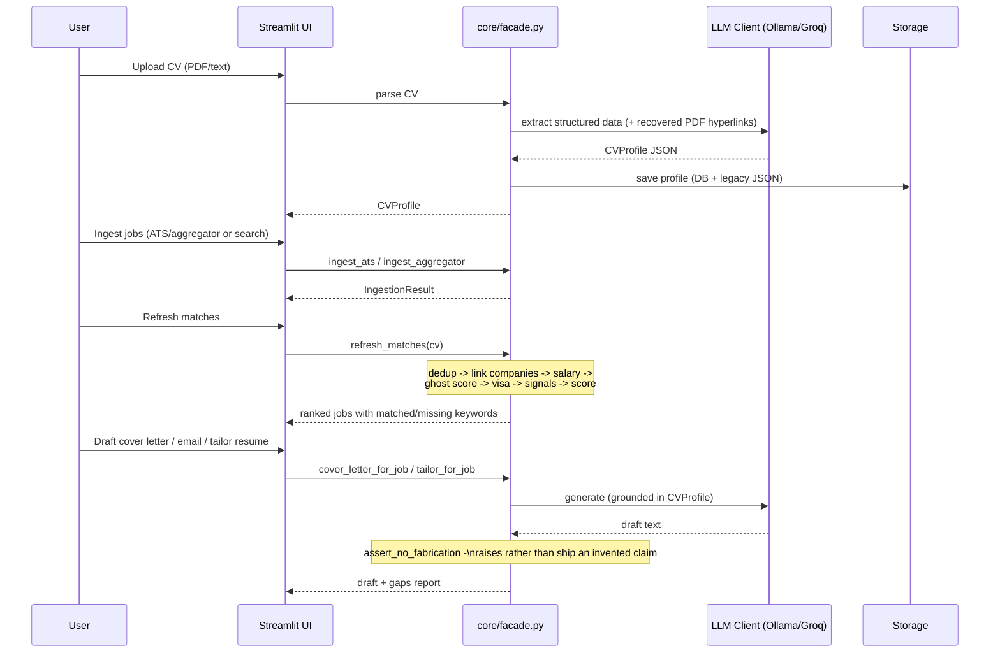

# CareerAgent Architecture

This document describes the software architecture of CareerAgent, a local
AI-powered career assistant for personalized job search and outreach.

## System overview

CareerAgent is a Streamlit UI over a `core/` package of independent business-
logic services, called only through `core/facade.py` — `app.py` holds no
business logic itself. LLM inference runs against Ollama locally by default,
with an OpenAI-compatible cloud provider (Groq's free tier) as an opt-in
alternative (see ADR 0005). Persistence is SQLModel on SQLite for dev
(Postgres in production, ADR 0003), with a legacy local-JSON path still used
for drafts/exports.

```mermaid
graph TB
    subgraph "Presentation Layer"
        UI[Streamlit UI<br/>app.py]
    end

    subgraph "Facade"
        Facade[core/facade.py]
    end

    subgraph "Core Services"
        CV[CV Parser]
        Resume[Resume: tailor, cover letter,<br/>ATS lint, render]
        Ingestion[Ingestion: ATS + aggregators]
        Fetching[Fetching: JSON-LD, polite crawler]
        Matching[Matching: embeddings, dedup, scoring]
        Tracking[Tracking: kanban pipeline]
        Outreach[Outreach: compliance gate]
        Enrichment[Enrichment: salary, visa, ghost score]
        Analytics[Analytics: funnel, interview prep]
        Alerting[Alerting: digest]
        CF[Contact Finder]
        PE[Personalization Engine]
        DV[Draft Validator]
    end

    subgraph "Integration Layer"
        LLM[LLM Client<br/>Ollama or Groq]
        Gmail[Gmail Drafts]
        WA[WhatsApp]
        DDG[DuckDuckGo Search]
    end

    subgraph "Data Layer"
        DB[(SQLite/Postgres<br/>core/db)]
        Storage[Local JSON Storage]
        Models[Pydantic Models]
    end

    subgraph "External Services"
        OllamaSvc[(Ollama, local)]
        GroqSvc[(Groq API, cloud)]
        GmailAPI[(Gmail API)]
        JobAPIs[(Greenhouse/Lever/Ashby/<br/>Adzuna/Muse/Remotive)]
    end

    UI --> Facade
    Facade --> CV
    Facade --> Resume
    Facade --> Ingestion
    Facade --> Fetching
    Facade --> Matching
    Facade --> Tracking
    Facade --> Outreach
    Facade --> Enrichment
    Facade --> Analytics
    Facade --> Alerting
    UI --> CF
    UI --> PE
    UI --> DV
    UI --> Gmail
    UI --> WA

    CV --> LLM
    Resume --> LLM
    CF --> LLM
    CF --> DDG
    PE --> LLM
    Ingestion --> JobAPIs

    LLM --> OllamaSvc
    LLM --> GroqSvc
    Gmail --> GmailAPI

    Facade --> DB
    CV --> Storage
    PE --> Storage

    CV --> Models
    Resume --> Models
    Ingestion --> Models
    Matching --> Models
```

## Component map

### Presentation

| Component | File | Description |
|-----------|------|-------------|
| Streamlit UI | `app.py` | 6-screen app: Onboarding, Job Discovery, Pipeline, Contact Finder, Draft Studio, Export & Logs. Calls only `core/facade.py`. |

### Facade

| Component | File | Description |
|-----------|------|-------------|
| Facade | `core/facade.py` | The single tested entry point the UI calls — session-managed, returns plain dicts (never ORM objects), keeps business logic out of `app.py`. |

### Core services

| Package/module | Description |
|---|---|
| `core/cv_parser.py` | PDF/text CV → structured `CVProfile` via LLM. Recovers PDF link-annotation URLs so it never has to guess a contact link. |
| `core/resume/` | `tailor.py` (truthful resume tailoring, `assert_no_fabrication`), `cover_letter.py` (grounded cover letters, same fabrication contract), `ats_linter.py`, `json_resume.py`, `render.py` (Markdown/PDF). |
| `core/ingestion/` | `ats.py` (Greenhouse/Lever/Ashby public feeds), `aggregators.py` (Adzuna/The Muse/Remotive) → canonical `JobPosting`. |
| `core/fetching/` | `ats_detection.py` (regex ATS signatures), `jsonld.py` (`schema.org/JobPosting` extraction), `polite.py` (robots.txt + rate-limited fetcher; scraping fallback only). |
| `core/matching/` | `embeddings.py` (pluggable embedder, hashing fallback), `dedup.py` (fuzzy dedup), `scoring.py` (explainable resume↔job score with matched/missing keywords). |
| `core/tracking.py` | Kanban application pipeline, follow-up reminders, duplicate-apply prevention, company blacklist. |
| `core/outreach/` | `verification.py`, `compliance.py` (CAN-SPAM/GDPR: postal address, opt-out, per-campaign LIA, suppression list), `service.py` (single pre-send gate). |
| `core/enrichment/` | `salary.py`, `company.py` (Glassdoor/layoffs, tri-state — `None` means unknown, never a false negative), `visa.py`, `ghost.py`, `filters.py`. |
| `core/alerting/` | `digest.py` (Markdown/RSS), `emitters.py` (Telegram/Discord). |
| `core/analytics.py` | Application→response funnel, A/B variant tracking, interview-prep generation. |
| `core/job_finder.py` | DuckDuckGo-based job search (fallback discovery mode; API-first ingestion above is preferred). |
| `core/contact_finder.py` | Hiring-contact search + email permutation generation. |
| `core/personalization.py` | Personalized email/WhatsApp draft generation. |
| `core/validators.py` | Draft quality gates (metric present, link present, CTA, word count, no emojis/bullets). |
| `extension/` | Manifest V3 human-in-the-loop autofill (Greenhouse/Lever/Ashby) — fills fields, never submits. |

### Integration layer

| Component | File | Description |
|-----------|------|-------------|
| LLM Client | `core/llm.py` | `LocalLLMClient` (Ollama) and `CloudLLMClient` (Groq free tier, OpenAI-compatible). `CloudLLMClient` subclasses the local client and overrides only the three HTTP-touching methods — JSON cleaning, retry, and schema validation are shared. |
| Gmail Drafts | `core/gmail_drafts.py` | Gmail API integration for draft creation. |
| WhatsApp | `core/whatsapp.py` | WhatsApp click-to-chat URL generation. |
| Prompts | `core/prompts.py` | LLM prompt templates for structured JSON responses. |

### Data layer

| Component | File | Description |
|-----------|------|-------------|
| DB models | `core/db/tables.py` | SQLModel schema (Company, jobs, applications, etc.); PII fields use `core/db/crypto.py`'s `EncryptedString`. |
| DB session | `core/db/session.py` | Engine/session management; `init_db` for dev/test, Alembic (`alembic/`) for migrations. |
| Repository | `core/db/repository.py` | Query/persistence layer over the SQLModel tables. |
| Models | `core/models.py` | Pydantic data models shared across the whole app (`CVProfile`, `JobPosting`, `ContactCandidate`, `EmailDraft`, ...). |
| Storage | `core/storage.py` | Legacy local-JSON persistence + ZIP export, still used for drafts/exports alongside the DB. |

## Data flow (CV → job → draft)



## Key design decisions

### Local LLM first, cloud as an explicit opt-in
Ollama is the default for all inference. `CloudLLMClient` (Groq) exists
because Ollama requires installing a separate runtime and pulling multi-GB
model weights before the app does anything useful. Choosing the cloud
provider sends prompt content (including CV/resume text) off the user's
machine — surfaced in the sidebar UI, the class docstring, and
`.env.example`. See ADR 0005 for the full reasoning and the guardrail
deviation this represents.

### Never fabricate
Resume tailoring (`assert_no_fabrication` in `core/resume/tailor.py`) and
cover letter generation (`assert_no_fabrication` in
`core/resume/cover_letter.py`) both raise rather than return output that
invents an employer, credential, or metric the CV doesn't support. Company
enrichment (`core/enrichment/company.py`) uses tri-state fields so *absence
of data* is never rendered as a false negative (e.g. "does not sponsor
visas").

### JSON-based LLM communication
Every LLM call requests a JSON response for structured parsing with
Pydantic validation, reliable extraction from unstructured text, and
automatic retry with a stricter prompt on parse failure.

### API-first job data
Ingestion prefers official ATS/aggregator APIs and JSON-LD extraction
(`core/ingestion/`, `core/fetching/`) over scraping. DuckDuckGo search
(`core/job_finder.py`) remains as an explicitly-labeled fallback mode.

### Human-in-the-loop autofill
The browser extension (`extension/`) fills form fields; it never submits.
A human always reviews before applying.

### Quality gates
Email drafts must pass validation before send: contains a metric, includes
a project link, references the target company, has a clear CTA, stays
under 180 words, no emojis or bullet dashes — plus the outreach compliance
gate (`core/outreach/`) blocking send until sender identity, postal
address, opt-out, and a per-campaign LIA are all present.

## Directory structure

```
CareerAgent/
├── app.py                    # Streamlit UI (calls only core/facade.py)
├── core/
│   ├── facade.py             # Single tested entry point for app.py
│   ├── llm.py                # LocalLLMClient (Ollama) + CloudLLMClient (Groq)
│   ├── models.py             # Pydantic data models
│   ├── prompts.py            # LLM prompt templates
│   ├── cv_parser.py          # CV extraction (+ PDF hyperlink recovery)
│   ├── job_finder.py         # DuckDuckGo job search (fallback mode)
│   ├── contact_finder.py     # Contact discovery
│   ├── personalization.py    # Email/WhatsApp draft generation
│   ├── validators.py         # Draft quality validation
│   ├── gmail_drafts.py       # Gmail API integration
│   ├── whatsapp.py           # WhatsApp URL generation
│   ├── storage.py            # Legacy local-JSON persistence + ZIP export
│   ├── normalize.py          # Shared text/company normalization helpers
│   ├── tracking.py           # Kanban application pipeline
│   ├── analytics.py          # Funnel, A/B tracking, interview prep
│   ├── db/                   # SQLModel schema, sessions, repository, crypto
│   ├── ingestion/            # ATS + aggregator job ingestion
│   ├── fetching/             # ATS detection, JSON-LD, polite fetcher
│   ├── matching/             # Embeddings, dedup, explainable scoring
│   ├── resume/                # Tailoring, cover letters, ATS lint, render
│   ├── outreach/             # Verification + compliance gate
│   ├── enrichment/           # Salary, company signals, visa, ghost score
│   └── alerting/             # Digest (Markdown/RSS/Telegram/Discord)
├── extension/                 # Manifest V3 human-in-the-loop autofill
├── alembic/                   # Database migrations
├── scripts/                   # Operational scripts (e.g. digest delivery)
├── tests/                     # pytest suite
├── assets/                    # style.css (dark-native theme)
├── docs/                      # RESEARCH.md, ADRs
├── .github/workflows/         # CI/CD configuration
├── Dockerfile
└── docker-compose.yml
```

## Deployment

### Local development
```bash
pip install -r requirements.txt -r requirements-test.txt
# Either: ollama serve && ollama pull llama3.1:8b
# Or: set GROQ_API_KEY in .env (free tier, no credit card: console.groq.com/keys)
streamlit run app.py
```

### Docker
```bash
docker-compose up
```
Starts the Streamlit application; point it at a reachable Ollama instance or
set `GROQ_API_KEY` for the cloud provider.

## Technology stack

| Layer | Technology | Purpose |
|-------|------------|---------|
| Frontend | Streamlit 1.29+ | Interactive web UI |
| LLM | Ollama (local) or Groq (free-tier cloud, OpenAI-compatible) | AI inference |
| Validation | Pydantic 2.5+ | Data validation and serialization |
| Persistence | SQLModel + Alembic, SQLite (dev) / Postgres (prod) | Structured storage, PII encrypted at rest |
| PDF parsing | pdfplumber, PyPDF2 | CV text + hyperlink extraction |
| PDF rendering | fpdf2 | ATS-friendly resume PDF output |
| Job data | Greenhouse/Lever/Ashby, Adzuna, The Muse, Remotive | API-first ingestion |
| Web search | duckduckgo-search | Fallback job/contact discovery |
| Email | Google Gmail API | Draft creation |
| Testing | pytest | Unit and integration tests (204+) |
