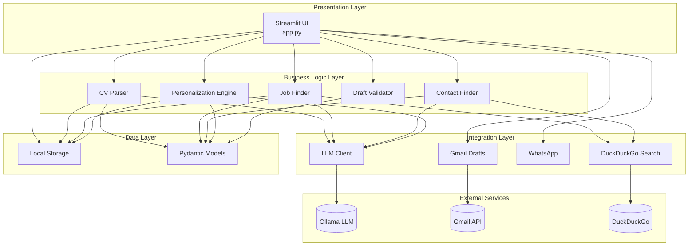
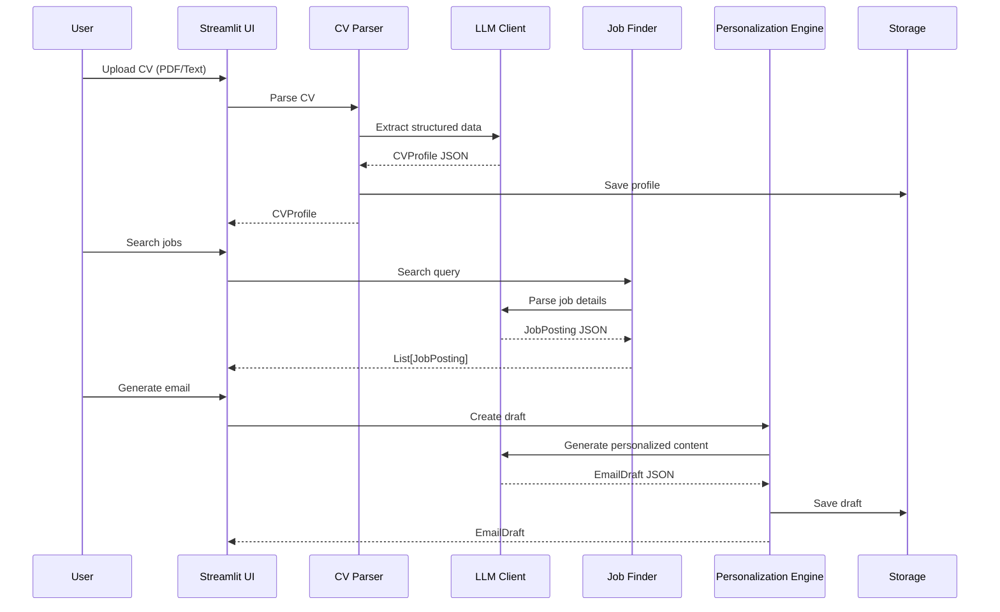

# CareerAgent Architecture

This document describes the software architecture of CareerAgent, a local AI-powered career assistant for personalized job outreach.

## System Overview

CareerAgent is built on a modern Python stack with Streamlit for the frontend and Ollama for local LLM inference. The architecture follows a modular design with clear separation of concerns.



## Component Descriptions

### Presentation Layer

| Component | File | Description |
|-----------|------|-------------|
| Streamlit UI | `app.py` | 5-screen application: Onboarding, Discovery, Contacts, Draft Studio, Export |

### Business Logic Layer

| Component | File | Description |
|-----------|------|-------------|
| CV Parser | `core/cv_parser.py` | Extracts structured data from PDF/text using LLM |
| Job Finder | `core/job_finder.py` | Searches for jobs using DuckDuckGo web search |
| Contact Finder | `core/contact_finder.py` | Finds hiring contacts and generates email permutations |
| Personalization Engine | `core/personalization.py` | Creates personalized email and WhatsApp drafts |
| Draft Validator | `core/validators.py` | Validates draft quality against professional standards |

### Integration Layer

| Component | File | Description |
|-----------|------|-------------|
| LLM Client | `core/llm.py` | Ollama API client with JSON parsing and retry logic |
| Gmail Drafts | `core/gmail_drafts.py` | Gmail API integration for draft creation |
| WhatsApp | `core/whatsapp.py` | WhatsApp click-to-chat URL generation |
| Prompts | `core/prompts.py` | LLM prompt templates for structured responses |

### Data Layer

| Component | File | Description |
|-----------|------|-------------|
| Models | `core/models.py` | Pydantic data models for type-safe structures |
| Storage | `core/storage.py` | Local JSON-based persistence and ZIP export |

## Data Flow



## Key Design Decisions

### Local LLM First
All AI inference uses local Ollama models for:
- Privacy: CV data never leaves the user's machine
- Cost: No API fees for inference
- Offline capability: Works without internet for draft generation

### JSON-Based Communication
LLM prompts request JSON responses for:
- Structured parsing with Pydantic validation
- Reliable data extraction from unstructured text
- Automatic retry with stricter prompts on parse failure

### Quality Gates
Email drafts must pass validation checks:
- Contains quantifiable metrics
- Includes project links
- References target company
- Clear call-to-action
- Under 180 words
- No emojis or bullet points

## Directory Structure

```
CareerAgent/
├── app.py                 # Main Streamlit application
├── core/                  # Business logic modules
│   ├── __init__.py
│   ├── llm.py            # Ollama LLM client
│   ├── models.py         # Pydantic data models
│   ├── validators.py     # Draft quality validation
│   ├── cv_parser.py      # CV extraction
│   ├── job_finder.py     # Job search
│   ├── contact_finder.py # Contact discovery
│   ├── personalization.py# Email/WhatsApp generation
│   ├── gmail_drafts.py   # Gmail API integration
│   ├── whatsapp.py       # WhatsApp URL generation
│   ├── prompts.py        # LLM prompt templates
│   └── storage.py        # Local JSON persistence
├── tests/                 # Test suite
├── assets/               # Static assets
├── .github/workflows/    # CI/CD configuration
├── Dockerfile            # Container configuration
└── docker-compose.yml    # Multi-container setup
```

## Deployment Options

### Local Development
```bash
pip install -r requirements.txt
ollama pull llama3.1:8b
streamlit run app.py
```

### Docker
```bash
docker-compose up
```

This starts both the Streamlit application and Ollama in containers.

## Technology Stack

| Layer | Technology | Purpose |
|-------|------------|---------|
| Frontend | Streamlit 1.29+ | Interactive web UI |
| LLM | Ollama (Llama 3.1, Qwen, Mistral) | Local AI inference |
| Validation | Pydantic 2.5+ | Data validation and serialization |
| PDF Parsing | PyPDF2, pdfplumber | CV text extraction |
| Web Search | duckduckgo-search | Job and contact discovery |
| Email | Google Gmail API | Draft creation |
| Testing | pytest | Unit and integration tests |
